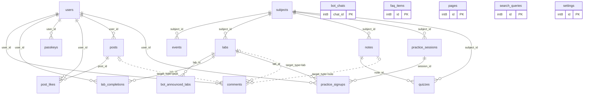

# 🎓 edu3105 — сайт группы М3105

> **[m3105.ru](https://m3105.ru)** — дедлайны, лабы, конспекты, квизы и запись на сдачи в одном месте.

Монорепозиторий: публичный сайт группы и админка, в которой весь контент заполняется через формы.

- 📅 **Неделя и календарь** — чип текущей недели с чётностью, календарь дедлайнов и ICS‑подписка для Google/Apple/Outlook с напоминанием за сутки.
- 🧪 **Лабораторные** — задание, требования, порядок сдачи, варианты, материалы, дедлайн и баллы. Есть нулевая лаба.
- 📝 **Конспекты** — лекции в MDX с формулами, подсветкой кода и компонентами.
- ❓ **Квизы** — самопроверка после лекции, конструктор и импорт JSON.
- 🙋 **Аккаунты** — вход через Telegram или пасскей, отметки «сделано» и запись на сдачи.
- 🗣️ **Мини‑соцсеть** — комментарии к конспектам и лабам, ленты «Шаверма» (обзоры точек с оценками) и «Анекдоты» с лайками; всё пишут студенты, админ модерирует.
- 🔍 **Поиск по сайту** — ⌘K из любой страницы: полнотекстовый поиск Postgres по конспектам, лабам, квизам, ЧаВо и страницам, со словоформами, поиском по мере набора и устойчивостью к опечаткам.
- 📲 **Работает офлайн** — сайт ставится на телефон как приложение, а прочитанные конспекты открываются в метро без связи.
- 💬 **ЧаВо и страницы** — произвольные статические страницы в MDX.

## 🧱 Стек

```
apps/web    Next.js 16 · React 19 · Tailwind 4 · shadcn (Base UI) · MDX · motion
apps/api    Go · chi · PostgreSQL (pgx, goose‑миграции) · Valkey (сессии, рейт‑лимит)
deploy/     nginx‑конфиг, который делит трафик между API и Next
docs/       api.md, quiz-format.md
scripts/    seed.ts — демо‑данные
```

## 🗂 Схема базы

Postgres, миграции — goose (`apps/api/internal/db/migrations`). Диаграмма собирается
из живой схемы командой `bun scripts/erd.ts`, так что она не расходится с миграциями.

<!-- erd:start -->



<details>
<summary>Та же схема с колонками</summary>



</details>

<!-- erd:end -->

```mermaid
erDiagram
    labs ||--o{ bot_announced_labs : "lab_id"
    users ||--o{ comments : "user_id"
    subjects ||--o{ events : "subject_id"
    labs ||--o{ lab_completions : "lab_id"
    users ||--o{ lab_completions : "user_id"
    subjects ||--o{ labs : "subject_id"
    subjects ||--o{ notes : "subject_id"
    users ||--o{ passkeys : "user_id"
    posts ||--o{ post_likes : "post_id"
    users ||--o{ post_likes : "user_id"
    users ||--o{ posts : "user_id"
    subjects ||--o{ practice_sessions : "subject_id"
    labs ||--o{ practice_signups : "lab_id"
    practice_sessions ||--o{ practice_signups : "session_id"
    users ||--o{ practice_signups : "user_id"
    notes ||--o{ quizzes : "note_id"
    subjects ||--o{ quizzes : "subject_id"
    notes |o..o{ comments : "target_type=note"
    labs |o..o{ comments : "target_type=lab"
    posts |o..o{ comments : "target_type=post"
    bot_announced_labs {
        int8 lab_id PK
        timestamptz announced_at
    }
    bot_chats {
        int8 chat_id PK
        int8 telegram_id
        text first_name
        text username
        bool subscribed
        text digest_sent_on
        timestamptz created_at
        timestamptz updated_at
    }
    comments {
        int8 id PK
        text target_type
        int8 target_id
        int8 user_id FK
        text body
        timestamptz created_at
        timestamptz updated_at
    }
    events {
        int8 id PK
        text title
        text kind
        int8 subject_id FK "может быть пустым"
        timestamptz starts_at
        timestamptz ends_at "может быть пустым"
        bool all_day
        text location
        text description
        text url
        timestamptz created_at
        timestamptz updated_at
    }
    faq_items {
        int8 id PK
        text question
        text answer
        text category
        int4 position
        timestamptz created_at
        timestamptz updated_at
        tsvector search_vector "может быть пустым"
    }
    lab_completions {
        int8 user_id PK
        int8 lab_id PK
        timestamptz completed_at
    }
    labs {
        int8 id PK
        int8 subject_id FK
        int4 number
        text slug
        text title
        text summary
        text content
        text requirements
        text submission
        text variants
        jsonb materials
        timestamptz deadline_at "может быть пустым"
        text deadline_note
        int4 max_score "может быть пустым"
        text teacher
        text status
        timestamptz created_at
        timestamptz updated_at
        tsvector search_vector "может быть пустым"
    }
    notes {
        int8 id PK
        int8 subject_id FK
        int4 number
        text slug
        text title
        text summary
        text content
        date lecture_date "может быть пустым"
        text status
        timestamptz created_at
        timestamptz updated_at
        tsvector search_vector "может быть пустым"
    }
    pages {
        int8 id PK
        text slug
        text title
        text summary
        text content
        int4 position
        bool show_in_nav
        text status
        timestamptz created_at
        timestamptz updated_at
        tsvector search_vector "может быть пустым"
    }
    passkeys {
        text id PK
        int8 user_id FK
        text label
        jsonb credential
        timestamptz created_at
        timestamptz last_used_at "может быть пустым"
    }
    post_likes {
        int8 post_id PK
        int8 user_id PK
        timestamptz created_at
    }
    posts {
        int8 id PK
        text kind
        int8 user_id FK
        text title
        text body
        text address
        int4 price "может быть пустым"
        int2 rating "может быть пустым"
        timestamptz created_at
        timestamptz updated_at
        text visibility
        bool nsfw
    }
    practice_sessions {
        int8 id PK
        int8 subject_id FK
        timestamptz starts_at
        timestamptz ends_at "может быть пустым"
        text location
        int4 capacity "может быть пустым"
        text note
        timestamptz created_at
        timestamptz updated_at
    }
    practice_signups {
        int8 id PK
        int8 session_id FK
        int8 user_id FK
        int8 lab_id FK
        timestamptz created_at
    }
    quizzes {
        int8 id PK
        int8 subject_id FK "может быть пустым"
        int8 note_id FK "может быть пустым"
        text slug
        text title
        text description
        jsonb questions
        bool shuffle_questions
        bool shuffle_options
        text status
        timestamptz created_at
        timestamptz updated_at
        tsvector search_vector "может быть пустым"
    }
    search_queries {
        int8 id PK
        text query
        int4 results
        timestamptz created_at
    }
    settings {
        int2 id PK
        text site_title
        text group_name
        text description
        date semester_start "может быть пустым"
        date semester_end "может быть пустым"
        text first_week_parity
        text timezone
        jsonb links
        timestamptz updated_at
        text invite_code
    }
    subjects {
        int8 id PK
        text slug
        text name
        text short_name
        text color
        text teacher
        text description
        jsonb links
        int4 position
        timestamptz created_at
        timestamptz updated_at
        text icon
        tsvector search_vector "может быть пустым"
    }
    users {
        int8 id PK
        bytea webauthn_id
        text name
        int8 telegram_id "может быть пустым"
        text telegram_username
        text photo_url
        timestamptz created_at
        timestamptz last_login_at
        text display_name
        text group_name
        timestamptz approved_at "может быть пустым"
    }
```

## 🚀 Локальная разработка

Нужны `bun` и `go`. Docker необязателен.

```bash
bun install

# API на :8080 со встроенным Postgres (скачается один раз)
cd apps/api && go run ./cmd/devapi

# Фронтенд на :3000, /api проксируется на API_URL
cp apps/web/.env.example apps/web/.env.local
bun dev
```

> [!TIP]
> Пароль админки в dev‑режиме — `dev-password-123`. Демо‑контент:
> `bun scripts/seed.ts --api http://localhost:8080 --password dev-password-123`

<details>
<summary>🐳 Вариант с Postgres и Valkey в Docker</summary>

```bash
make infra              # docker compose -f docker-compose.dev.yml up -d
cp apps/api/.env.example apps/api/.env
make api                # go run ./cmd/api
bun dev
```

</details>

**Проверки:** `make lint` (Biome + go vet) · `make typecheck` · `make test` (Go, включая сквозной тест на встроенном Postgres).

## ☁️ Деплой

Docker Compose за общим Traefik: на сервере уже есть внешняя сеть `virtual-hosts` и cert‑резолвер `myresolver`. Compose поднимает nginx (`proxy`) с Traefik‑лейблами для домена, а nginx разводит трафик: `/api/*` → Go (`api:8080`), остальное → Next.js (`web:3000`). Postgres и Valkey живут во внутренней сети и наружу не торчат.

```bash
git clone https://github.com/kewldan/m3105.git edu3105 && cd edu3105
cp .env.example .env      # DOMAIN, POSTGRES_PASSWORD, ADMIN_PASSWORD, TELEGRAM_BOT_*
docker compose up -d --build
```

### Проверки и автодеплой

Ветки и пулл-реквесты прогоняются через [`CI`](.github/workflows/ci.yml), который переиспользует
[`checks.yml`](.github/workflows/checks.yml): Biome, `tsc`, `golangci-lint` и `go test`.
Типы фронтенда генерируются из OpenAPI (`bun run codegen`), а контрактные тесты в `apps/api` следят,
чтобы спека не разошлась ни с роутером, ни с реальными ответами, ни с тегами кеша.
Обновления зависимостей приносит Dependabot раз в неделю одной пачкой на экосистему.

Пуш в `main` запускает workflow [`Deploy`](.github/workflows/deploy.yml):

1. **Проверки** — тот же `checks.yml`: `biome check`, `tsc --noEmit`, `golangci-lint`, `go test` (включая сквозной тест на встроенном Postgres).
2. **Сборка** — образы `web`, `api` и `backup` собираются в Actions с кэшем buildx и уходят в GHCR с тегами `latest` и sha коммита.
3. **Деплой** — по SSH на сервере `git reset --hard` до этого коммита (конфиги, nginx, скрипты), `docker compose pull` и `up -d`, затем проверка `/api/v1/healthz` и главной. Сам прод ничего не собирает.

Для этого в репозитории нужны секреты `DEPLOY_HOST`, `DEPLOY_USER`, `DEPLOY_SSH_KEY`, `DEPLOY_KNOWN_HOSTS`, а на сервере — клон репозитория с заполненным `.env` (он в `.gitignore` и переживает `git reset`).

| Действие | Команда |
| --- | --- |
| Задеплоить | `git push` в `main`, либо `gh workflow run deploy.yml` |
| Срочно, без проверок | `gh workflow run deploy.yml -f skip_checks=true` |
| Откатиться | на сервере `IMAGE_TAG=<sha> docker compose up -d web api` |
| Собрать на сервере вручную | `docker compose up -d --build` (обходит GHCR) |
| Логи | `make logs` |
| Бэкап вручную | `docker compose run --rm backup once` (архив в Telegram и в томе `backup-data`) |
| Только дамп базы | `docker compose exec postgres pg_dump -U edu edu > backup.sql` |

> [!IMPORTANT]
> Данные лежат в томах `postgres-data` и `valkey-data`. Не удаляйте их вместе со стеком (`docker compose down -v`), если не хотите потерять контент.

### 💾 Ежедневные бэкапы

Сервис `backup` (`deploy/backup/`) раз в сутки в `BACKUP_HOUR` по `TZ` делает `pg_dump` всей базы, кладёт рядом `.env`, `docker-compose.yml` и `deploy/`, собирает `edu3105-<дата>.tar.gz` и отправляет его документом в Telegram на `BACKUP_CHAT_ID`. Последние `BACKUP_KEEP` архивов остаются на сервере в томе `backup-data`, так что бэкап есть даже если Telegram недоступен. Если архив не влезает в лимит Bot API (50 МБ), вместо файла приходит предупреждение с путём на сервере.

Внутри архива лежит `MANIFEST.txt` с порядком восстановления: распаковать, вернуть `config/.env` и `config/docker-compose.yml` в каталог проекта на сервере, поднять `postgres`, залить `db.sql` через `psql` и пересобрать стек.

> [!CAUTION]
> В архив входит `.env` с паролем админки, токеном бота и паролем Postgres. Он уходит в личный чат с ботом — не пересылайте его в группы.

## 🔐 Аккаунты студентов

Вход без паролей. Аккаунт создаётся при первом входе через **Telegram Login Widget**, затем в профиле можно добавить **пасскей** и входить по Face ID / Touch ID.

1. Создайте бота в [@BotFather](https://t.me/BotFather).
2. Выполните `/setdomain` с доменом сайта.
3. Положите `TELEGRAM_BOT_TOKEN` и `TELEGRAM_BOT_USERNAME` в `.env`.

> [!NOTE]
> Пасскеям нужен HTTPS. Новый аккаунт ждёт подтверждения в разделе «Студенты» админки: там же можно заменить имя из Telegram на имя и фамилию. Если в настройках задан **код доступа**, введённый при первом входе код подтверждает аккаунт сразу.

Что даёт аккаунт: отмечать лабы сделанными (и прятать их из списка) и записываться на сдачу — занятия, которые создаются в админке в разделе «Сдачи».

## 🤖 Telegram‑бот

Тот же бот, что используется для входа, работает и как уведомлялка. Запускается автоматически вместе с API, если задан `TELEGRAM_BOT_TOKEN`.

- 🆕 **Новые лабы** — сообщение всем подписчикам сразу после публикации (проверка раз в минуту).
- ⏰ **Напоминания** — каждый день в `BOT_DIGEST_HOUR` (по умолчанию 10:00 по таймзоне сайта) список несданных лаб с дедлайном в ближайшие 3 дня и просроченных.
- 📅 `/deadlines`, 🧪 `/labs`, 🔔 `/notify` (вкл/выкл), `/help` — плюс кнопки меню после `/start`.

> [!NOTE]
> Если студент вошёл на сайте через Telegram, бот учитывает отметки «сделано» и не напоминает о сданных лабах. Без аккаунта бот шлёт все дедлайны. Пользователь, заблокировавший бота, автоматически отписывается.

## 🛠 Админка

`https://<домен>/admin`, пароль из `ADMIN_PASSWORD`. Сессия живёт 30 дней в Valkey; десять попыток входа за 15 минут с одного IP блокируют вход. Для скриптов есть `ADMIN_API_TOKEN`: с заголовком `Authorization: Bearer <token>` админские эндпоинты работают без входа (так публикует конспекты `scripts/content.ts`).

**Порядок заполнения:** Настройки (дата начала семестра и чётность первой недели) → Предметы → Лабы и события → Сдачи → Конспекты → Квизы → ЧаВо и страницы.

> [!WARNING]
> Лабы, конспекты, квизы и страницы публикуются переключателем статуса. Черновики на сайте не видны.

## ✍️ Контент

- **MDX** в конспектах, лабах, ЧаВо и страницах: Markdown + формулы (`$x^2$`, `$$…$$`), подсветка кода (` ```c title="main.c" `), таблицы и компоненты:
  - `<Callout type="info|tip|warning|danger|success" title="…">`
  - `<Spoiler title="…">`
  - `<Steps>` с обычным нумерованным списком внутри
- **Квизы**: формат описан в [docs/quiz-format.md](docs/quiz-format.md); в админке есть конструктор и импорт JSON.
- **Календарь**: дедлайны лаб, контрольные, экзамены, консультации и сдачи; `/api/v1/calendar.ics` — подписка, у дедлайнов, контрольных и экзаменов напоминание за сутки. Ближайшие события дублируются на главной в блоке «События».

📖 **API**: публичная часть описана в OpenAPI 3.1 — спека [`openapi.yaml`](apps/api/internal/api/openapi.yaml), на сайте [`/api/v1/openapi.yaml`](https://m3105.ru/api/v1/openapi.yaml) и интерактивная документация [`/api/v1/docs`](https://m3105.ru/api/v1/docs). Эндпоинты админки и аккаунтов — в [docs/api.md](docs/api.md).
